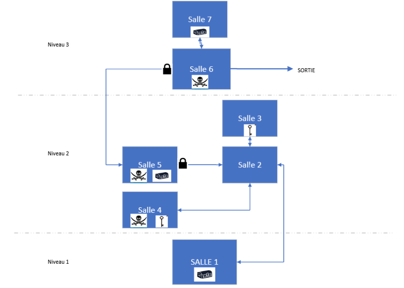

# Jeu : Coincer dans un donjon

## Resumer

Il y'a 3 niveaux de diffciultées  
- Facile – il commence alors avec 20 points de vie et 8 fioles de soin.
- Intermédiaire – il commence alors avec 10 points de vie et 4 fioles de soin.
- Difficile – il commence alors avec 5 points de vie et 1 fiole de soin.

Le joueur doit naviguer dans un donjon.  
Le donjon est composé de 7 salles.  
Chaque salle a sa propre description.    
Certaines salle possédent soit des coffres, des enemis, des clefs.  
Le joueur peut donc posseder une arme, des potion de soins et des clefs.
## Plan du jeu

## Pseudo code par salle

### Salle 1 - Salle du debut coffre arme 
intro  
description de la salle  
indication du coffre + openning   
ajouter arme a l'inventaire   
indication choix passer la porte  
Si oui alors change de piece  
Sinon attendre puis reproposer  

### Salle 2 - Salle vide 
description salle  
choix vers quel porte aller  
si porte salle 3 aller salle 3  
si porte salle 4 aller salle 4  
si porte salle 5 sans la clef  
alors texte indication porte fermer  
sinon liasser passer    
### Salle 3 - Salle avec clef salle 6
description salle  
texte fouille + trouve la clef  
Choix retourner dans la salle 2  
si oui alors aller dans la salle 2  
sinon attendre et reproposer 
### Salle 4 - Salle ennemie garde clef salle 5
Description salle  
combat  
text recuperation de la clef
### Salle 5 - Salle demi boss + coffre de soin
description salle + ennemi
combat
texte recuperation de la potion de soin (nombre en fonction de la difficultée)  
choix prochaine salle  
si salle 2 aller salle 2  
si salle 6 aller salle 6  
### Salle 6 - Salle de Boss sortie
description salle + ennemi  
combat  
choix salle  
si salle 5 aller salle 5  
si sortie alors text fin   
### Salle 7 - Salle de tresor
description salle   
texte + recuperation d'or  
choix salle  
si salle 6 aller salle 6  
sinon attendre et reproposer 
## Fonctions suplémentaire

### Mort du joueur
afficher mort 
proposer de recommencer
### Combat

### Affichage vie et clef et potion de soin
affichage en haut et cadrer de la vie et du nombre de clefs

### intro()
appel salle1()
